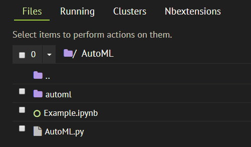

# AutoML инструмент для предсказания

Данный инструмент позволяет обучать модели в автоматическом режиме, только предоставив как входнные параметры
* датафрейм с фичами
* массив истинных значений таргета

# Как использовать

В директорию, откуда будет вестись работа, необходимо поместить файл `AutoML.py`. В результате, директория будет
выглядеть таким образом:

